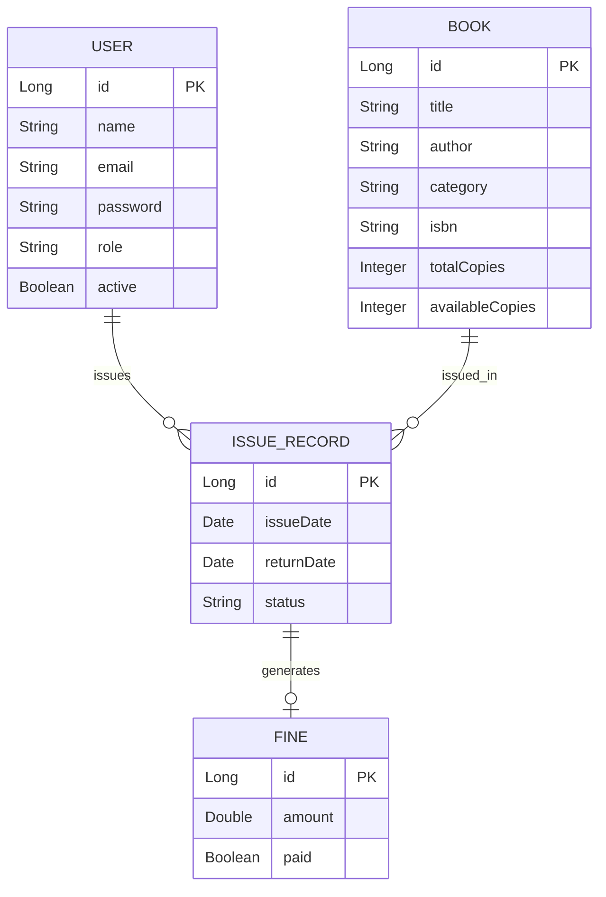

# Digital Library Management System

##  Project Overview

The **Digital Library Management System** is a web-based application designed to automate and digitize all major functionalities of a traditional library. The system aims to simplify book management, user interactions, issuing and returning of books, fine calculation, and reporting — all through a user-friendly interface.

This project is built using **Spring Boot**, **PostgreSQL**, **Thymeleaf**, and follows a clean layered architecture aligned with industry best practices.

##  Objectives

* Digitize complete library operations
* Reduce manual bookkeeping
* Provide role-based access (Admin & Users)
* Enable easy book search, issue, and return
* Automatically calculate fines
* Maintain data integrity using a relational database

##  Modules

###  Admin Module

Admins have full control over the system:

* Add, update, delete books
* Manage users
* View all issued records
* Monitor fines

###  User Module

Normal users have limited access:

* Register and login
* Browse and search books
* Issue and return books
* View issued books and fines
* Contact admin via email (optional extension)

##  Tech Stack

### Backend

* Java 21
* Spring Boot
* Spring Data JPA
* Spring Validation

### Frontend

* Thymeleaf
* HTML5, CSS3

### Database

* PostgreSQL

### Build Tool

* Maven

##  ER Diagram



##  Application Properties (Sample)

```properties
spring.datasource.url=jdbc:postgresql://localhost:5432/digital_library
spring.datasource.username=postgres
spring.datasource.password=postgres

spring.jpa.hibernate.ddl-auto=update
spring.jpa.show-sql=true
spring.jpa.properties.hibernate.dialect=org.hibernate.dialect.PostgreSQLDialect

spring.thymeleaf.cache=false
spring.thymeleaf.prefix=classpath:/templates/
spring.thymeleaf.suffix=.html

server.port=8080
```

##  How to Run the Project

1. Create a PostgreSQL database: `digital_library`
2. Update credentials in `application.properties`
3. Run the Spring Boot application
4. Access the app at: `http://localhost:8080`


##  Future Enhancements

* Email notifications
* Book reservation system
* Role-based security using Spring Security
* Reports & analytics dashboard

##  Author

Developed as an academic & learning project using Spring Boot for internship at Oasisinfobyte

 If you like this project, feel free to extend it into a full-scale Library ERP system!
